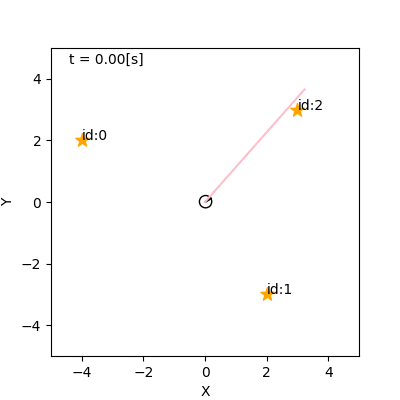
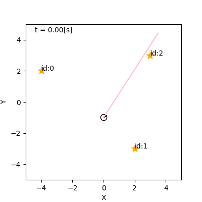

## 4. 不確かさのモデル化

千葉工業大学 上田 隆一
2019年4月24日

 

This work is licensed under a <a rel="license" href="http://creativecommons.org/licenses/by-sa/4.0/">Creative Commons Attribution-ShareAlike 4.0 International License</a>.

---

### 実世界の不確かさ（センサ）

* 例
    * 同じものを計測しても毎回違う値（偶然誤差・雑音）
    * 周囲に観測するものがない
    * 定常的に計測値がずれる（系統誤差・バイアス）
    * 壁だと思ったら人までの距離を計測（過失誤差）

<iframe width="560" height="315" src="https://www.youtube.com/embed/RpPcmyXOcr4?start=2444" frameborder="0" allow="accelerometer; autoplay; encrypted-media; gyroscope; picture-in-picture" allowfullscreen></iframe>

---

### 実世界の不確かさ（動き）

* 例
    * 小石・縁石を踏んだ、人に持ち上げられた
        * 前のスライドのムービー
    * モータへの指令値と実際の出力が少しずれている
        * 「ロボットがまっすぐ走らないんですよ」（当たり前）
        * ひどい例: 床が違うと脚ロボットの動きは大きく変わる
        * もっとひどい例: 人がロボットを捕まえて離さない/別の場所に運ぶ

<iframe width="260" height="315" src="https://www.youtube.com/embed/wNm9dhWBqZM" frameborder="0" allow="accelerometer; autoplay; encrypted-media; gyroscope; picture-in-picture" allowfullscreen></iframe>

---

### 雑音のシミュレーション

* 動きに関するもの
* 観測に関するもの

---

### 路面からの雑音のシミュレーション

* モデル化の例: ある一定の 確率で小石を踏む
    * 以下のパラメータで頻度と 深刻度が決まる
        * どれだけの確率で起こるか
        * 踏んだらどれだけロボットが ずれるか
    * [実装例](https://github.com/ryuichiueda/LNPR_BOOK_CODES/blob/master/section_uncertainty/noise_simulation2.ipynb)
        * 前者を指数分布、 後者をガウス分布でモデル化

---

### 路面からの雑音のシミュレーション
#### 「小石を踏む」のモデル化 

* 偶然に何か起こる確率は指数分布に従う
$$
	p(x | \lambda ) = \lambda e^{-\lambda x} \  (x > 0)
$$
    * $x$: ロボットの移動量（道のり）
    * $\lambda$: $x$あたりに踏む小石の数の期待値
    * $x \sim p(x | \lambda )$で次に小石を踏むまでの道のりが決定できる
* [Jupyter Notebookでの例](https://github.com/ryuichiueda/LNPR_BOOK_CODES/blob/master/distributions/exponential.ipynb)

---

### 路面からの雑音のシミュレーション
#### 「小石を踏んで姿勢変化」のモデル化

* ロボットの方向$\theta$にガウス分布に従う雑音を加える
$$
	p(\theta | \mu, \sigma^2 ) = \dfrac{1}{\sqrt{2\pi}\sigma} \exp\left[ - \dfrac{(\theta - \mu)^2}{2\sigma^2} \right] = \mathcal{N}(\theta | \mu, \sigma^2)
$$
* 手続き: ロボットの姿勢を$(x \ y \ \theta)^T$次のように更新
$\begin{eqnarray}
    (x \ y \ \theta)^T &\longleftarrow& (x \ y \ \theta)^T + (0 \ 0 \ \theta')^T \\\\
    &\text{where}&\ \theta' \sim p(\theta | \mu, \sigma^2 )
\end{eqnarray}$
    * 位置はあまりずれないので雑音を加えず

---

### 出力のバイアスのシミュレーション

* モータへの指令値$(\nu \ \omega)^T$を更新するごとに同じ割合だけ雑音として加える（系統誤差）
* 手続き
    * 初期化: 
$ \begin{pmatrix} \delta_\nu  \\\\ \delta_\omega \end{pmatrix}\sim \mathcal{N}\left[ \begin{pmatrix} \delta_\nu \\\\ \delta_\omega \end{pmatrix} \Big| \begin{pmatrix} 0 \\\\ 0 \end{pmatrix} , \begin{pmatrix} \sigma_\nu^2 & 0 \\\\ 0 & \sigma_\omega^2 \end{pmatrix} \right] $
        * $\sigma_\nu, \sigma_\omega$: パラメータ
    * その後: 
$
    (\nu \ \omega)^T \longleftarrow (\delta_\nu \nu \ \delta_\omega \omega)^T 
$

---

### [実装例](https://github.com/ryuichiueda/LNPR_BOOK_CODES/blob/master/section_uncertainty/noise_simulation_bias.ipynb)

* キャリブレーションで小さくすることは可能
    * 根絶は無理
* 事前に予想ができないので厄介

---

### 他の誤差の例

* スタック（ロボットの脱輪など。左図）
    * 指数分布で次に脱輪するまでの時間をシミュレーション
    * 脱輪から抜け出すまでの時刻も指数分布で
* 誘拐（人によるロボットの位置変更。右図）
    * これも指数分布でタイミングを決定
    * 置き直し姿勢は一様分布からドロー

---

### センサ値に混入する 雑音のシミュレーション

* 本書で言うところの雑音: 偶然誤差の原因
    * 熱、電気、光、風、水蒸気、・・・
    * 非常に多種多様だが、まとめるとガウス分布に従う
        * 例: 2章の200[mm]のセンサ値の分布
        * 中心極限定理

---

### [実装例](https://github.com/ryuichiueda/LNPR_BOOK_CODES/blob/master/section_uncertainty/noise_simulation7.ipynb)

* センサ値の距離、向き$\ell,\varphi$に毎回それぞれ$\Delta \ell, \Delta \varphi$を足す
    * $\Delta\ell = \mathcal{N}[0, (\ell\sigma_\ell)^2 ] $
        * 距離に比例する大きさの標準偏差
    * $\Delta\varphi = \mathcal{N}[0, \sigma_\varphi^2] $
        * 一定の標準偏差

---

### センサ値に混入する バイアスのシミュレーション

* 長時間にわたって値を偏らせる要因
    * 環境の違い、変化
        * 例: 2章の600[mm]のセンサ値
* 実装は移動に加えるバイアスと同じ
    * [実装例](https://github.com/ryuichiueda/LNPR_BOOK_CODES/blob/master/section_uncertainty/noise_simulation8.ipynb)
    * あらかじめバイアスの大きさを決めておく
        * 距離: 距離に比例した量を足す
        * 方向: 方向に無関係に決まった量を足す

---

### ファントム

* 見えないはずのものが見えてしまう
    * 偽陽性

---

### 見落とし

* 見えるはずのものが見えない
    * 偽陰性

---

### オクルージョン

* 観測対象の手前にものがある
    * カメラで大きさを測るとき: 小さく見えてしまう
    * LiDARで壁までの距離を測るとき: 壁が手前に見えてしまう

