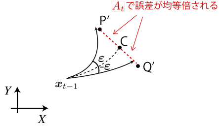

## 6. カルマンフィルタによる自己位置推定

千葉工業大学 上田 隆一

 

This work is licensed under a <a rel="license" href="http://creativecommons.org/licenses/by-sa/4.0/">Creative Commons Attribution-ShareAlike 4.0 International License</a>.

---

### ガウス分布で信念分布を近似

* 時刻$t$における信念$b_t$を$b_t = \mathcal{N}(\mathcal{\mu}_t, \Sigma_t)$と近似
    * $\mathcal{\mu}_t$: 分布の中心（推定姿勢とみなすこともできる）
    * $\Sigma_t$: 共分散行列
* 下図: とりあえず描画した信念分布（[コード](https://github.com/ryuichiueda/LNPR_BOOK_CODES/blob/master/section_kalman_filter/kf2.ipynb)）
    * まだ動かない
    * $XY$平面の不確かさを誤差楕円、$\theta$方向の不確かさを青い線分の範囲で図示

---

### 移動後の信念分布の更新

* 信念のパラメータを計算する必要がある
    * MCLならパーティクルをロボットと同じように動かせばよかった
* 式
    * $\hat{b}\_t(\boldsymbol{x}) = \int\_{\boldsymbol{x}' \in \mathcal{X}} p(\boldsymbol{x} | \boldsymbol{x}', \boldsymbol{u}\_t) b\_{t-1}(\boldsymbol{x}')  d\boldsymbol{x}' = \big\langle p(\boldsymbol{x} | \boldsymbol{x}', \boldsymbol{u}\_t) \big\rangle\_{b\_{t-1}(\boldsymbol{x}')}$
    * MCLと同じ
    * ただし、これを計算してもガウス分布にならない
        * $p(\boldsymbol{x} | \boldsymbol{x}', \boldsymbol{u}\_t)$がガウス分布という保証はない（大抵違う。参考: [MCLでのパーティクルの動き](https://ryuichiueda.github.io/LNPR_SLIDES/slides/chap5_60min.html?#/18)）
        * $p(\boldsymbol{x} | \boldsymbol{x}', \boldsymbol{u}\_t)$がガウス分布でも$b_{t-1}$とかけて積分するとガウス分布にならない（$b_{t-1}$と変数が違うので）

---

### 状態遷移モデルの近似 1/4

* 本来ガウス分布でない$p(\boldsymbol{x} | \boldsymbol{x}', \boldsymbol{u}\_t)$をガウス分布に
* 手順
    1. 速度、角速度を$\boldsymbol{u}' \sim \mathcal{N}(\boldsymbol{u}, M_t)$でモデル化 （これは[MCLで使ったモデル](https://ryuichiueda.github.io/LNPR_SLIDES/slides/chap5_60min.html?#/16)の場合、近似なしでガウス分布）
        * $M\_t = \begin{pmatrix} \sigma^2\_{\nu\nu}|\nu\_t|/\Delta t + \sigma^2\_{\nu\omega}|\omega\_t|/\Delta t & 0 \\\\ 0 & \sigma^2\_{\omega\nu}|\nu\_t|/\Delta t + \sigma^2\_{\omega\omega}|\omega\_t|/\Delta t \end{pmatrix}$
    1. この$\nu\omega$空間中のガウス分布を$XY\theta$空間に写像
        * ここで分布が歪む（下図のように、PとQがCに対して対称にならない）

---

### 状態遷移モデルの近似 2/4

* $\boldsymbol{x}\_t \sim p(\boldsymbol{x} | \boldsymbol{x}\_{t-1}, \boldsymbol{u}\_t)$を次のように近似
    * $\boldsymbol{x}\_t \approx \boldsymbol{f}(\boldsymbol{x}\_{t-1}, \boldsymbol{u}\_t) + A\_t (\boldsymbol{u}\_t' - \boldsymbol{u}\_t)$
        * $\boldsymbol{f}$: 状態遷移関数
        * $A\_t = \dfrac{\partial \boldsymbol{f}}{\partial \boldsymbol{u}}\Big|\_{\boldsymbol{x}=\boldsymbol{x}\_{t-1},\boldsymbol{u}=\boldsymbol{u}\_t}$

---

### 状態遷移モデルの近似 3/4

* 状態遷移関数の偏微分
    * 状態方程式
        * $\\boldsymbol{f}(\\boldsymbol{x}, \\boldsymbol{u}) = \\begin{pmatrix} x \\\\ y \\\\ \\theta \\end{pmatrix} + \\begin{pmatrix} \\nu\\omega^{-1}\\left\\{\\sin( \\theta + \\omega \\Delta t ) - \\sin\\theta \\right\\} \\\\ \\nu\\omega^{-1}\\left\\{-\\cos( \\theta + \\omega \\Delta t ) + \\cos\\theta \\right\\} \\\\ \\omega \\Delta t \\end{pmatrix}$
    * 状態方程式の偏微分
        * $ \\dfrac{\\partial \\boldsymbol{f}}{\\partial \\boldsymbol{u}} = \\begin{pmatrix} \\partial f\_x/\\partial \\nu & \\partial f\_x/\\partial \\omega \\\\ \\partial f\_y/\\partial \\nu & \\partial f\_y/\\partial \\omega \\\\ \\partial f\_\\theta/\\partial \\nu & \\partial f\_\\theta/\\partial \\omega \\end{pmatrix} \\nonumber \\\\ \hspace{-5em} = \\begin{pmatrix} \\omega^{-1}\\left\\{\\sin( \\theta + \\omega \\Delta t ) - \\sin\\theta \\right\\} & -\\nu\\omega^{-2}\\left\\{\\sin( \\theta + \\omega \\Delta t ) - \\sin\\theta \\right\\} + \\nu\\omega^{-1}\\Delta t \\cos( \\theta + \\omega \\Delta t )  \\\\ \\omega^{-1}\\left\\{-\\cos( \\theta + \\omega \\Delta t ) + \\cos\\theta \\right\\} & -\\nu\\omega^{-2}\\left\\{-\\cos( \\theta + \\omega \\Delta t ) + \\cos\\theta \\right\\} + \\nu\\omega^{-1}\\Delta t\\sin( \\theta + \\omega \\Delta t ) \\\\ 0 & \\Delta t \\end{pmatrix}$
    * これに$\boldsymbol{x} = \boldsymbol{x}\_{t-1}, \boldsymbol{u} = \boldsymbol{u}_t$を代入すると$A_t$となる

---

### 状態遷移モデルの近似 4/4

* $\boldsymbol{x}\_t \approx \boldsymbol{f}(\boldsymbol{x}\_{t-1}, \boldsymbol{u}\_t) + A\_t (\boldsymbol{u}\_t' - \boldsymbol{u}\_t)$の分布は？ 
    * $\Longrightarrow \boldsymbol{u}'$のばらつき$\boldsymbol{u}' \sim \mathcal{N}(\boldsymbol{u}, M_t)$が右辺の$\boldsymbol{f}(\boldsymbol{x}\_{t-1}, \boldsymbol{u}\_t)+$ $A\_t (\boldsymbol{u}\_t' - \boldsymbol{u}\_t)$で$XY\theta$空間に線形に写像される
* $\boldsymbol{x}\_t \sim \mathcal{N}(\boldsymbol{x}\_{t-1}, R_t)$とすると$R_t = A_t M_t A_t^\top$
    * 理由は付録B.1.10
